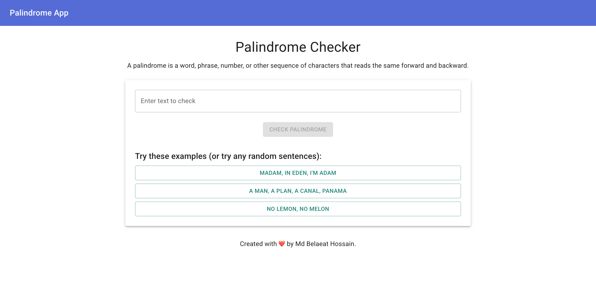

# Simple Palindrome Checker Application
A palindrome is a word, phrase, number, or other sequence of characters that reads the same forward and backward.

## Technologies Used

- Core: React, TypeScript, Vite
- Design: Material UI
- Unit Testing: React Testing Library, Vitest, Jest

## Website

Visit here: https://belaeat-palindrome.netlify.app

## Screen

